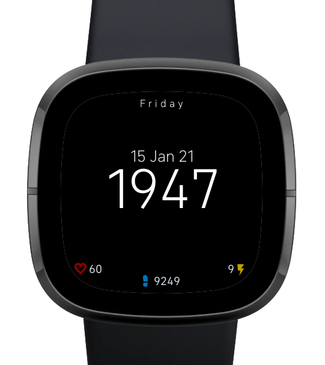

# Almost Military Clockface
Minimalistic clockface primarily designed for the fitbit sense and versa 3, inspired by the military time and date format.
Supports English, German, and French (to a degree).
Pull requests for additional translations and bugfixes are welcome!
For feature requests, please create an issue in the issue tracker.
May or may not work on other fitbit devices.
